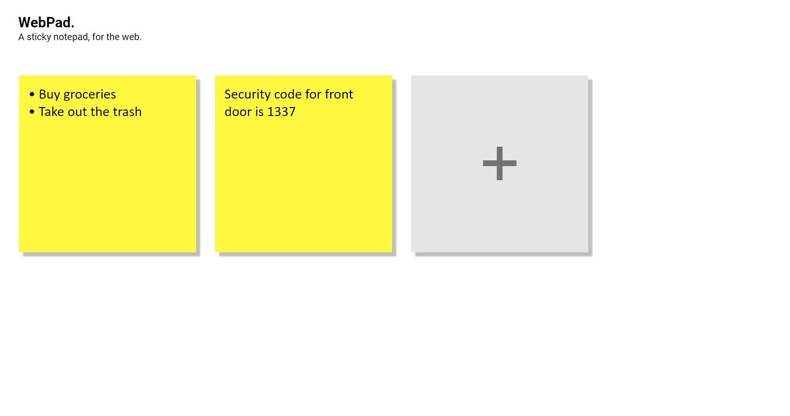

# Webpad - Sticky Notepad

  

## [Demo](https://waterrmalann.github.io/webpad/)   |   [Source](https://github.com/waterrmalann/webpad/blob/main/js/main.js)

A simple web application to take notes within the browser in an organized manner. As a person who takes a lot of notes, this was made mostly out of necessity. The UI is inspired by [this youtube tutorial](https://www.youtube.com/watch?v=Efo7nIUF2JY). All data is stored locally on the computer by the browser. This whole project was written in HTML, CSS, and pure vanilla JavaScript with no external dependencies.



---

### Setup

A live version and up to date version of the web app is available [here](https://waterrmalann.github.io/webpad/). If you wish to modify the app or host it yourself, you can clone the repo and do whatever you want with it.

1. [Clone the repository](https://docs.github.com/en/github/creating-cloning-and-archiving-repositories/cloning-a-repository-from-github/cloning-a-repository).
```
git clone https://github.com/waterrmalann/webpad.git
```
2. Install the dependencies.
```
npm install
```
3. This will start a live server. Head to the IP shown in the console.
```
npm run serve
```

---

### To-Do

- Add a tiny cross mark when you hover over a card to make the delete UX better.
- Double click a card to expand it into a modal like view.
- Ability to change theme, and font.

### Contribution

Contributions are always accepted. Feel free to open a pull request to fix any issues or to make improvements you think that should be made. You could also help me with the to-do list above. Any contribution will be accepted as long as it doesn't stray too much from the objective of the app. If you're in doubt about whether the PR would be accepted or not, you can always open an issue to get my opinion on it.

License
----

MIT License, see [LICENSE](LICENSE)
